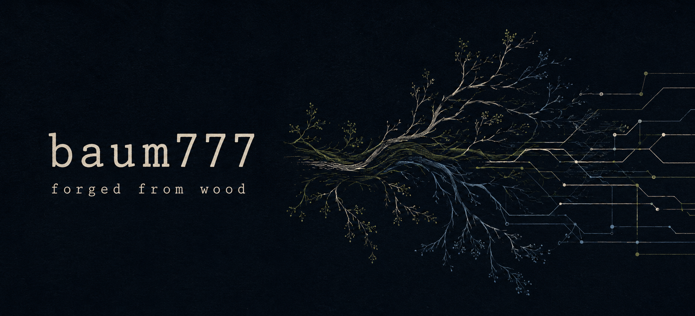

..a recurring curiosity:

How can separate things become a coherent whole without losing what makes them distinct?

*the shape of things*

**Trees, memory, software and institutions share an interesting problem: whatever grows must somehow remain connected.**

Roots carry history. Branches explore possibility. Boundaries give things enough shape to interact.

---

In software, these relationships become explicit: context, interfaces, dependencies, permissions. An intuition acquires a structure that can be examined, questioned and changed.

The interesting territory lies between free association and precise construction. Enough openness for an unexpected connection. Enough discipline to discover whether it holds.

# UNITERA OS
---

An architecture for continuity, agency and accountable action.

*UNITERA gives this way of thinking a larger form.*

- Its vision is an environment where knowledge, people and artificial intelligence can work together across time — carrying context forward, developing ideas and acting within understandable boundaries.

- An observation can become a question. A question can grow into a proposal. A proposal can lead to an authorized action whose consequences are checked. What happened can then inform what comes next.

- Each transition has its own meaning. Remembering something does not make it true. Understanding an action does not grant permission to perform it. Reporting success does not establish its outcome.

---
These distinctions give a growing system something to hold on to.
