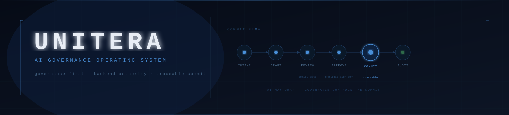

# Cheikh Fall

Building **UNITERA** — an AI Governance Operating System for business commitments.

A governance-first layer between enterprise systems and AI models, controlling
AI-assisted processes through to accountable, auditable commits.

**OfferFlow** is the first application on the OS — a revenue commitment workflow
for proposals, RFPs, and change requests.

---

## Stack

---

## What I build

- Governed workflow systems with explicit review, approval, and audit paths
- Multi-tenant SaaS with backend-enforced authority and Row Level Security
- AI integrations where the model drafts but the system controls the commit
- Model-agnostic architectures where providers are swappable without changing governance logic
- Agentic workflows and process automations using Claude Code, MCP, and API-first integrations

---

## Projects

| Project | Description |
|---|---|
| [UNITERA Systems](https://www.uniterasystems.com/en) | AI Governance OS — governed commit path for business commitments |
| [proof.uniterasystems](https://proof.uniterasystems.com) | Evidence surface — architecture reference and synthetic artifacts |
| Model-Agnostic Working | Portable architecture for swappable AI model providers |

---

Portfolio: [portfolio.uniterasystems.com](https://portfolio.uniterasystems.com)  
